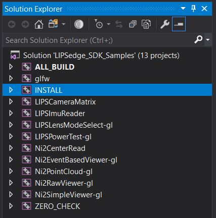
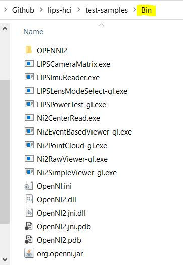
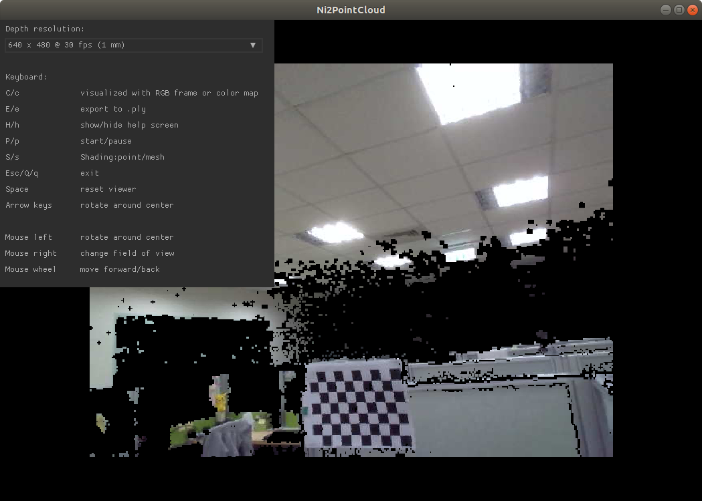

# LIPSedge SDK samples
Here we collect several samples using OpenNI2 programming interface to stream depth and color images of LIPSedge camera.
There are some examples showing device management handled by OpenNI2 framework.

## List of Samples:
|Name|Description|Camera|
|----|----|----|
|[LIPSCameraMatrix](./LIPSCameraMatrix)| Simple OpenNI2 program to query supported video modes and list camera intrinsic/extrinsic parameters| all LIPSedge cameras |
|[LIPSImuReader](./LIPSImuReader)| Program to read IMU sensor data (Accel. & Gyro) from LIPSedge camera | camera with IMU sensor support, e.g. LIPSedge M3 |
|[LIPSLensModeSelect-gl](./LIPSLensModeSelect-gl)| Controll LIPSedge camera to switch between two range modes, normal and near(or closed), at run time. | camera that supports multi range modes, e.g. LIPSedge DL/M3 |
|[LIPSPowerTest-gl](./LIPSPowerTest-gl)| Put camera into sleep mode to shutdown projector/emitter temporarily | camera that supports sleep mode, e.g. LIPSedge DL/M3 |
|[Ni2CenterRead](./Ni2CenterRead)| Simple OpenNI2 program to show depth value at center point of frame | all LIPSedge cameras |
|[Ni2EventBasedViewer-gl](./Ni2EventBasedViewer-gl)| OpenNI2 device management by event-driven design | all LIPSedge cameras |
|[Ni2PointCloud-gl](./Ni2PointCloud-gl)| An OpenNI2 sample uses OpenGL to visualize pointcloud data in 3D | LIPSedge camera that supports image registration |
|[Ni2RawViewer-gl](./Ni2RawViewer-gl)| A simple tool to read OpenNI2 frames captured as raw data format | all LIPSedge cameras |
|[Ni2SimpleViewer-gl](./Ni2SimpleViewer-gl)| A simplifiled version of NiViewer that uses OpenGL to disply Depth/IR/Color frames | all LIPSedge cameras |


### LIPSedge SDK installation:
  * Visit [LIPS website](https://www.lips-hci.com/lipssdk) to download our latest SDK for your LIPSedge 3D camera.

#### Linux installation:
  * Important build tools, like CMake, make, g++, git, are ready in your Linux system.
  * Running `sudo ./install.sh` for installation, then you can setup OpenNI2 software development environment by sourcing the config file.
  ```
  $ source OpenNIDevEnvironment
  ```

#### Windows installation:
  * In default case, OpenNI2 software is installed to path `C:\Program Files\OpenNI2\Redist`. You can find library and camera drivers in it.

## Build samples:
  Use CMake (command line or GUI tool) to complete build configuration and generation.
  ```
  $ mkdir build
  $ cd build
  $ cmake ..
  $ make
  ```

## OpenNI2 runtime dependency:
#### Linux installation:
After build completed, use `make install` to install required OpenNI2 runtime resources to the default output folder `Bin`.
```
$ make install
$ cd ../Bin/
```
> NOTE: OpenNI2 runtime resources for Linux:                               
> `libOpenNI2.so`                                   
> `OpenNI2/Drivers/libmodule-lips2.so`

#### For Windows installation:
Open project in Visual Studio, left-click the projct `INSTALL` from Solution Explorer and select option **Build** or **Rebuild**.
<p align="left"></p>

After build completed, you can find OpenNI2 runtime resources copied to the default output folder `Bin`.
<p align="left"></p>

> NOTE: OpenNI2 runtime resources for Windows:               
`OpenNI2.dll`                                         
`OPENNI2/Drivers/DeviceModule2.dll` (for LIPSedge DL/M3, you can replace it to your camera driver)                       
`OPENNI2/Drivers/RvcLib.dll`

## Running samples:
Switch to output folder `Bin` to run sample program, for example, you can run `Ni2PointCloud-gl` to view pointcloud streaming.
```
$ cd Bin
Bin$ ./Ni2PointCloud-gl
```

<p align="center"></p>
